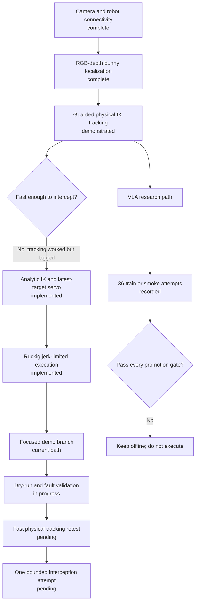

# Explain the current project status

The project is in the final retest phase on `demo-realtime-intercept-minimal`. Physical IK tracking worked, but its first implementation was too slow. The focused analytic-IK and jerk-limited control path awaits an equivalent robot test.

## Project status flow

The project has completed the research and implementation stages required for one bounded hardware test:

## Status by subsystem

| Subsystem | Current status | Evidence |
| --- | --- | --- |
| Robot camera relay | Working on hardware | Persistent 60 FPS-class H264 pipeline is active on the G1 |
| YOLO bunny detection | Working on live video | July 27 dry runs reached about 49–51 inference FPS |
| Depth and tabletop localization | Working, with intermittent availability | Live runs recorded fresh depth, but some sessions rejected targets when the support plane disappeared |
| Guarded ROS 2 arm control | Working on hardware | Commissioning and tracked physical movement were completed |
| Collision-aware IK tracking | Demonstrated, but slow | The G1 moved well to follow the bunny in physical tests |
| Analytic fast IK | Implemented and benchmarked offline | 0.080 ms median local step; final robot retest pending |
| Ruckig trajectory shaping | Implemented in `aarav-vla` and retained on the current branch | Velocity, acceleration, and jerk limits are exposed in bridge health |
| Real-time interception state machine | Implemented and dry-run tested | Frame provenance, freshness, revalidation, and rejection telemetry are present |
| UniFoLM-VLA training | Extensive offline experimentation complete | 36 train or smoke attempts exist; 32 produced action checkpoints |
| Learned-policy promotion | Blocked by evidence | No model beat all required baselines and safety gates |
| Focused demo branch | Current working path | One commit removed 25,756 research and legacy lines while retaining the interception runtime |
| Verified bunny interception | Not yet demonstrated | This is the objective of the final physical retest |
| Verified grasp | Out of scope for current hand configuration | The current practical target is palm contact/interception |

## What changed after the working physical demo

The working physical tracker used a slower global or finite-difference-heavy IK path. The revised stack adds:

- An analytic Pinocchio Jacobian for fast local servo steps
- Ruckig velocity, acceleration, and jerk-limited target updates
- Warm starts from the measured right-arm pose
- A cached collision-checked hip escape corridor
- Latest-target-wins updates for moving objects
- Explicit RGB/depth frame provenance
- Bounded commit, revalidation, hold, and stop states
- More deterministic cross-host ROS 2 discovery
- A high-FPS RGB service separated from depth capture, with eight consecutive healthy samples required before readiness

These changes target the measured bottleneck without removing the robot-side safety boundary.

The current branch also removes VLA training, dataset conversion, legacy control tools, and overlapping launch paths from the demo surface. Those artifacts remain preserved in `aarav-vla`, `vla-sim`, and the training store.

## Current blockers

The final test still has three practical blockers:

1. The start pose must clear a small hand-to-hip collision margin before task IK begins
2. The tabletop support plane must remain available or be held only within its validated freshness window
3. The optimized servo must reproduce the earlier tracking quality on hardware at a meaningfully higher response rate

## Final test sequence

The next physical session should remain staged:

1. Start the robot bridge disarmed and confirm fresh arm state
2. Start the GB10 in dry-run mode and verify camera, YOLO, depth, and frame pairing
3. Confirm a valid table plane and collision-free guided arm-clearance path
4. Run fast IK tracking without contact and compare response lag with the earlier controller
5. Test target loss, stale depth, support-plane loss, and operator stop
6. Enable one bounded moving-bunny interception attempt with a spotter and physical e-stop
7. Preserve the run manifest, telemetry, video, rejection counts, and measured contact outcome

## Definition of success

The final test succeeds only if the robot:

- Tracks the moving bunny faster than the previous physical implementation
- Uses current RGB, depth, and arm state
- Maintains collision and tabletop clearance
- Stops safely on stale data or target loss
- Reaches controlled palm contact or a clearly measured intercept

Model inference is not required for this geometric-control milestone. The learned-policy track remains a separate research result until it beats offline baselines and passes non-paused closed-loop simulation.
