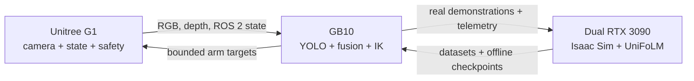

# Build the project presentation

This outline supports a 12–15 minute technical presentation. Each slide has one job and a suggested visual.

## Slide 1: The challenge

**Title:** Can a Unitree G1 track and intercept a moving plush bunny?

**Key points:**

- Live perception, prediction, IK, and robot safety must operate as one loop
- The target moves while sensing, planning, and actuation introduce latency
- The practical goal is controlled palm contact, not a verified fingered grasp

**Suggested visual:** A photo of the G1, bunny, and tabletop with three labels: see, predict, move.

## Slide 2: What we built

**Key points:**

- 60 FPS-class robot camera relay and YOLO detection
- RGB-depth fusion and tabletop calibration
- Guarded ROS 2 arm controller and collision-aware IK
- Isaac Sim data generation and real demonstration curation
- UniFoLM-VLA training, evaluation, and promotion gates

**Suggested visual:** Five blocks from camera to guarded robot command.

## Slide 3: Distributed system architecture

**Key points:**

- G1: camera, measured state, final safety guard, Unitree command publisher
- GB10: detection, depth fusion, tracking, IK, research UI
- Dual RTX 3090 host: Isaac Sim, datasets, UniFoLM training, evaluation

**Suggested visual:**

## Slide 4: Project journey

**Key points:**

- `aarav`: vision, commissioning, ROS 2, physical IK, and bunny tracking
- `sim`: parallel MuJoCo/MJX controller tuning
- `vla-sim`: Isaac bunny assets, capture, and dataset conversion
- `aarav-vla`: VLA experiments, analytic IK, and live interception
- `lightweight-intercept-isaac`: privileged oracle evaluation
- `demo-realtime-intercept-minimal`: current concise hardware-demo path

**Suggested visual:** A branched timeline ending with the current minimal demo branch. Show research inheritance without implying a Git merge.

## Slide 5: First major hardware result

**Title:** The robot tracked the bunny, but not fast enough

**Key points:**

- Physical arm movement and continuous IK tracking worked
- Collision checks and robot-side command guards remained active
- Planning and update latency limited moving-target interception
- This result motivated a faster local servo instead of abandoning geometric control

**Suggested visual:** A short tracking video or three sequential frames with the palm path overlaid.

## Slide 6: Building the Isaac Sim dataset

**Key points:**

- More than 20 scene and contact iterations
- 480 moving-bunny simulation episodes in v28
- 4.6 GB final moving-block source dataset
- Iterated on camera realism, contact, friction, occlusion, and trajectory diversity

**Suggested visual:** A grid of early failed scenes and the final v28 scene.

## Slide 7: Curating real robot demonstrations

**Key points:**

- 127 raw episodes audited
- 97 accepted/reviewed episodes materialized without modifying raw data
- 67 episodes passed the strict canonical timing, motion, image, and contact contract
- Splits were held out by capture session to reduce leakage

**Suggested visual:** Funnel chart: 127 → 97 → 67.

## Slide 8: Final training dataset

**Key points:**

- 547 canonical episodes
- 480 Isaac Sim and 67 real XR-teleoperation episodes
- 32,051 total frames
- Separate train, validation, and sealed test sessions

**Suggested visual:** Stacked bars for sim and real counts across train, validation, and test.

## Slide 9: What the first VLA runs showed

**Key points:**

- The store contains 36 training or smoke attempts; 32 produced action checkpoints
- Full and v28 staged schedules produced valid checkpoints
- Sealed real-test ADE remained 0.1443 m
- The model reacted to images, but did not beat holding the current pose
- Output magnitude and saturation were larger problems than training duration

**Suggested visual:** A run funnel: 36 attempts → 32 with checkpoints → several offline selections → zero robot-authorized checkpoints.

## Slide 10: The key research breakthrough

**Title:** Align targets with achieved future state

**Key points:**

- Recorded commands did not match delayed achieved motion
- Anchored relative actions beat matched absolute actions
- Future-state alignment reduced weighted ADE from 0.08535 m to 0.06695 m
- Improvement: 21.6%

**Suggested visual:** Before/after target timeline and a two-bar error chart.

## Slide 11: Why we still did not deploy the VLA

**Key points:**

- The improved model still lost to static hold-pose and mean-action baselines
- Real predicted motion was 2.14 times the target displacement
- About 8.8% of outputs saturated
- Every failing checkpoint remained unauthorized for robot execution

**Suggested visual:** A promotion funnel with the model stopped at “baseline and calibration gate.”

## Slide 12: Engineering the faster controller

**Key points:**

- Replaced finite-difference Jacobian updates with analytic Pinocchio steps
- Median local step latency: 0.136 ms → 0.080 ms
- About 41% faster in the offline benchmark
- Added warm starts, cached escape paths, latest-target-wins updates, and Ruckig jerk limits

**Suggested visual:** Latency bars plus the new control-loop state machine.

## Slide 13: Focus the repository on the final demo

**Key points:**

- `demo-realtime-intercept-minimal` starts from the final `aarav-vla` control stack
- One reduction commit removed 25,756 lines across 183 files
- The branch retains perception, interception, IK, collision checks, Ruckig, and robot safety
- VLA and simulation history remains preserved on the research branches

**Suggested visual:** Before-and-after repository blocks, with retained runtime components highlighted.

## Slide 14: Current status

**Key points:**

- Physical IK tracking: demonstrated
- Optimized fast path: implemented and dry-run tested
- Learned policy: improved offline, not promoted
- Final task: retest fast tracking and one bounded physical interception

**Suggested visual:** Use the Mermaid project-status flow from `CURRENT_STATUS.md`.

## Slide 15: Takeaways

**Key points:**

- Safe robot learning requires deterministic guards outside the model
- Data and target semantics mattered more than adding training steps
- Negative results identified the actual bottleneck
- The project now has a testable final hypothesis: faster IK can convert working tracking into interception

**Suggested closing line:** “We moved from ‘can the robot follow it?’ to ‘can it follow fast enough, with evidence and safety?’”
