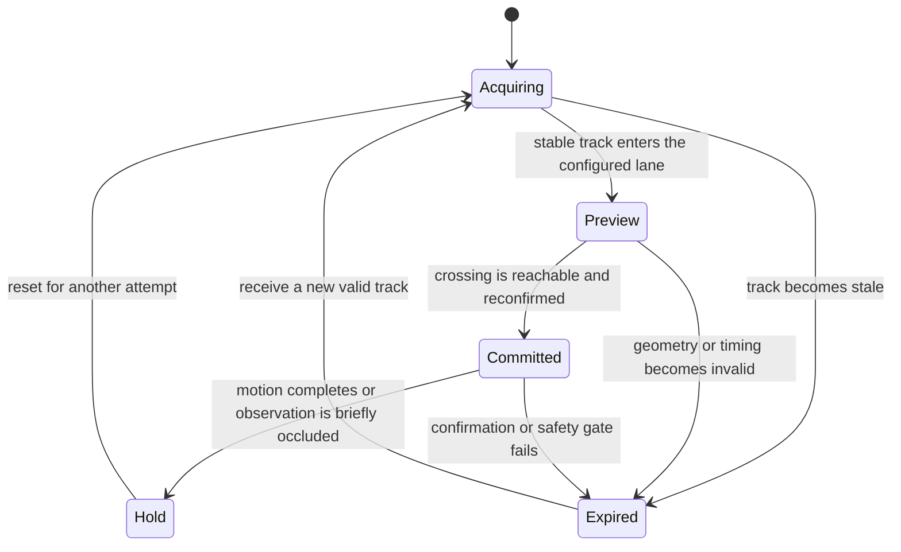

# Explain how the complete system works

This page defines the major technologies in the project and shows how they combine into one guarded robot-control loop. Use it to explain the system to an audience that has not worked with robotics or robot learning.

## End-to-end runtime flow

The current demo follows one bounded path from camera data to robot motion:

```mermaid
flowchart LR
    A[D435I RGB and depth] --> B[H264 RGB relay and ROS 2 depth]
    B --> C[YOLO bunny detection]
    C --> D[RGB-depth alignment and 3D localization]
    D --> E[Alpha-beta position and velocity tracking]
    E --> F[Plane-crossing intercept decision]
    F --> G[Analytic Pinocchio IK step]
    G --> H[Joint, collision, and table checks]
    H --> I[Ruckig trajectory shaping]
    I --> J[Robot-side 250 Hz safety controller]
    J --> K[Unitree right arm]
    K -->|measured state| E
    K -->|following error and faults| J
```



The loop is closed because measured robot and target states feed the next update. No component can publish an unchecked Cartesian target directly to the motors.

## RealSense RGB and depth

The Intel RealSense D435I supplies color images and per-pixel depth. RGB identifies the bunny, while depth estimates its distance from the camera.

The robot sends:

- H264-compressed RGB over a User Datagram Protocol (UDP) stream
- Bounded compressed depth over Robot Operating System 2 (ROS 2)

RGB stays outside the control middleware because video compression and delivery have different latency needs. Depth uses a keep-latest queue so stale frames do not accumulate.

## YOLO object detection

You Only Look Once (YOLO) is a real-time object detector. It returns a bounding box and confidence score for the bunny in each RGB frame.

The detector does not control the arm. It supplies a tracked image location. The runtime rejects low-confidence, stale, or geometrically invalid detections before planning motion.

## RGB-depth fusion and calibration

RGB-depth fusion converts the bunny’s image coordinates into a 3D point. The pipeline aligns depth with the RGB camera, applies the D435I camera model, and transforms the point into the robot torso frame.

Calibration defines:

- Camera intrinsics and distortion
- Camera-to-torso transform
- Table plane and tabletop footprint
- The camera serial and profile associated with those values

The runtime requires matching calibration identifiers. This prevents a valid calibration from one camera or profile from being applied to another.

## Target tracking and prediction

Raw 3D detections move because of bunny motion, depth noise, and detector jitter. An alpha-beta filter estimates smoothed position and velocity.

The current focused interception path uses measured velocity to predict where the bunny will cross a configured plane. The project also contains an optional gated recurrent unit (GRU) trajectory forecaster. If the learned forecaster is unavailable or implausible, the runtime keeps the classical alpha-beta prediction.

## Plane-crossing interception

Tracking asks the arm to follow the latest target. Interception instead predicts a specific future crossing point and time.

The live controller uses four stages:



The controller checks that the predicted crossing lies inside a bounded lane, occurs within the timing window, and remains reachable from the ready pose.

## Inverse kinematics

Forward kinematics calculates the palm pose from joint angles. Inverse kinematics (IK) solves the opposite problem: which shoulder, elbow, and wrist angles move the palm toward a desired 3D target?

The project uses two IK modes:

- **Global IK**: searches for a complete pose or waypoint route; robust but approximately 230 ms per benchmark target
- **Local analytic IK**: takes one bounded damped-least-squares step from the measured pose; designed for frequent closed-loop updates

For a desired palm displacement \(\Delta x\), the local solver computes a joint update:

\[
\Delta q = J^T(JJ^T + \lambda^2I)^{-1}\Delta x
\]

Here, \(J\) is the palm translation Jacobian, \(\lambda\) damps unstable motion near singular configurations, \(\Delta x\) is Cartesian error, and \(\Delta q\) is the proposed joint change.

## Pinocchio and the analytic Jacobian

Pinocchio provides robot kinematics and collision geometry from the official G1 model. The analytic Jacobian calculates how each joint changes palm position without perturbing every joint numerically.

The offline comparison measured:

| Local IK backend | Median step time | Mean error after one step | Accepted steps |
| --- | ---: | ---: | ---: |
| Finite-difference Jacobian | 0.136 ms | 0.30 mm | 64/64 |
| Analytic Pinocchio Jacobian | 0.080 ms | 0.30 mm | 64/64 |

The analytic step reduced median Jacobian latency by about 41% while preserving the same error reduction. The benchmark covers one local step, not the full camera-to-robot loop.

## Collision and tabletop validation

An IK result is only a proposal. The safety layer checks:

- Official joint ranges with additional margins
- Maximum joint change per update
- Full-link self-collision geometry
- Table-plane clearance inside the calibrated footprint
- Swept motion between the measured and proposed states
- A validated escape path if the starting posture is too close to the hip

The runtime rejects the target if any check fails. It does not ask IK to trade safety against target accuracy.

## Ruckig trajectory generation

IK produces a desired joint target, but sending discontinuous targets can create abrupt motion. Ruckig converts each accepted target into time-indexed joint positions, velocities, and accelerations.

The robot bridge enforces configured limits for:

- Joint velocity
- Joint acceleration
- Joint jerk, the rate of acceleration change

Ruckig does not replace IK. IK decides where the arm should move. Ruckig decides how the joints approach that target smoothly.

## ROS 2 and DDS

ROS 2 carries arm state, depth, commands, and commissioning services between the G1 and GB10. Data Distribution Service (DDS) is the network middleware beneath ROS 2.

The current split tracking path uses CycloneDDS with explicit peers. Some commissioning and isolated depth paths use Fast DDS. The robot and GB10 run different Ubuntu, Python, and ROS 2 releases, so both sides build the same tracked message definitions.

The robot owns the final command boundary:

- GB10 publishes a bounded seven-joint target
- The robot validates state freshness, ownership, motion mode, and following error
- Only the robot-local controller publishes Unitree `/arm_sdk` commands
- Heartbeat or network loss triggers a bounded release

## Isaac Sim, MuJoCo, and MJX

The project used different simulators for different questions:

| Tool | Role |
| --- | --- |
| Isaac Sim | Render camera observations, simulate the bunny scene, generate synthetic demonstrations, and evaluate contact-aware interception |
| MuJoCo | Test G1 arm-control candidates with a lightweight physics model |
| MJX | Batch MuJoCo-style controller evaluation on graphics processing units (GPUs) |

Simulation reduced hardware risk and increased experiment throughput. It could not prove real-camera calibration, DDS behavior, or physical contact safety.

## RLDS and TensorFlow Datasets

Reinforcement Learning Datasets (RLDS) defines episode and step records for sequential robot data. TensorFlow Datasets (TFDS) provides the loader format expected by the UniFoLM training stack.

The conversion pipeline combined:

- Isaac Sim episodes
- Real XR-teleoperation demonstrations
- Images, robot state, actions, timing, and contact metadata
- Session-held-out train, validation, and sealed test splits

The final canonical v29 dataset contains 547 episodes and 32,051 frames.

## Vision-Language-Action models

A Vision-Language-Action (VLA) model maps an image, a language instruction, and robot state to a sequence of actions. This project adapted Unitree’s UniFoLM-VLA to the moving-bunny task.

The VLA path used:

1. Camera observations and the instruction
2. A 23-dimensional robot pose/action representation
3. Predicted right-arm motion extracted from the output
4. Geometric IK and collision checks before any possible execution

The VLA never received direct motor authority. Every checkpoint remained behind baseline, magnitude, visual-conditioning, simulation, and robot-safety gates.

## Why the current branch is deterministic

The VLA campaign improved target semantics but did not produce a checkpoint that beat all promotion gates. Physical IK tracking already worked, with latency as its main weakness.

The `demo-realtime-intercept-minimal` branch therefore focuses on the shortest validated hypothesis:

```text
working physical tracking
    + faster analytic IK
    + predicted plane crossing
    + jerk-limited joint motion
    + existing robot safety
    = final bounded interception test
```

The research branches retain VLA training and evaluation history. The current branch removes those dependencies from the demo runtime without erasing their findings.
